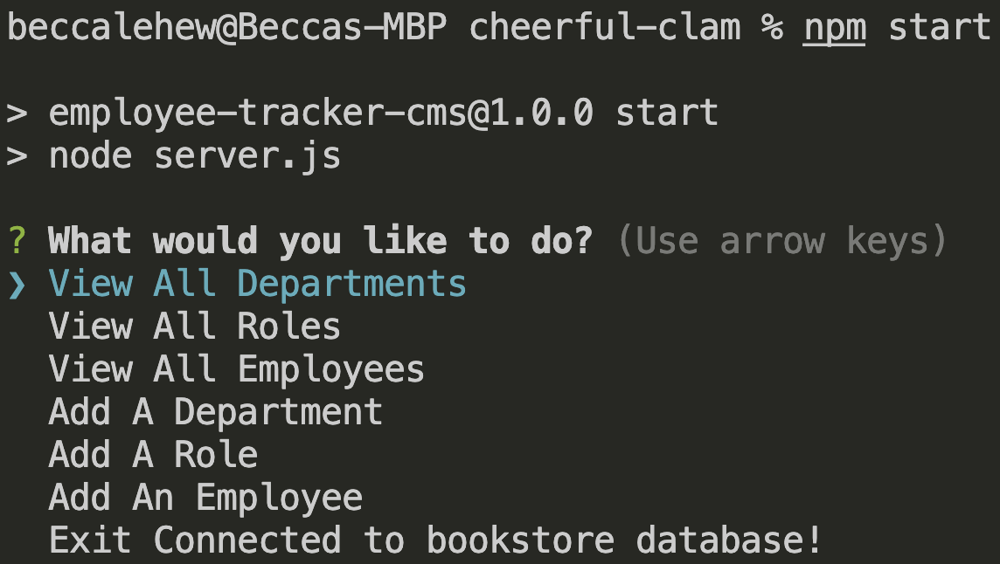
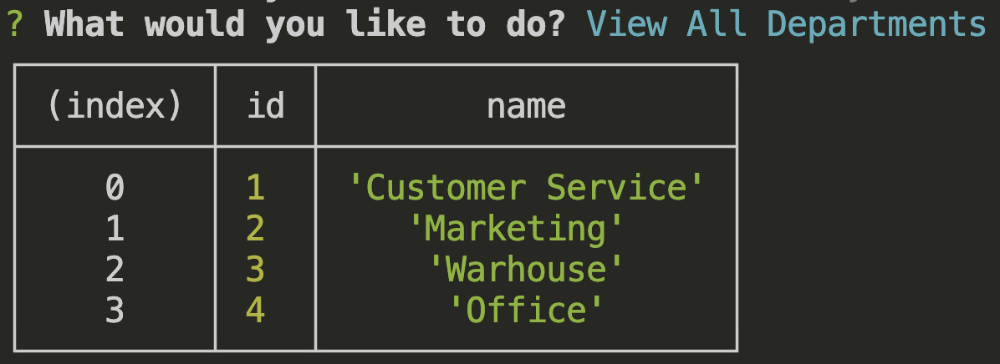
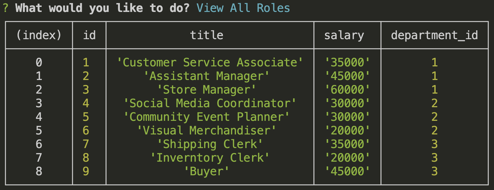
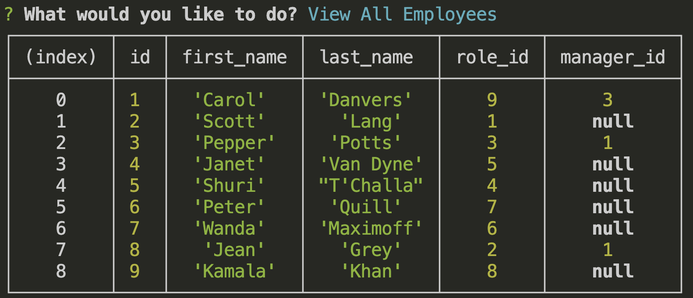
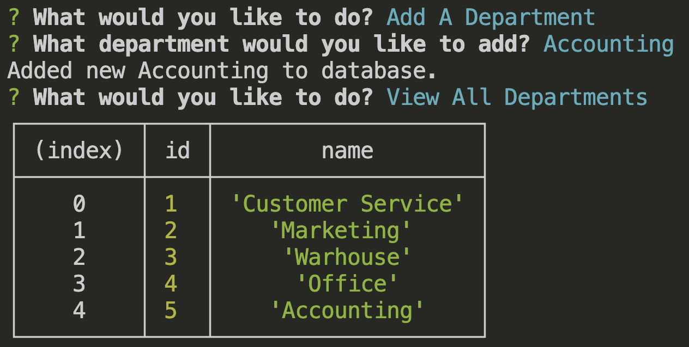
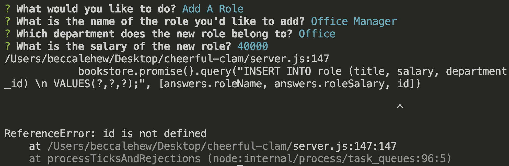
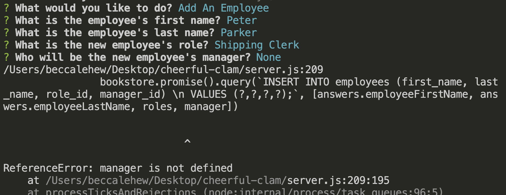

# Employee Tracker CMS


## Table of Contents:
- [Project Description](#description)
- [Installation](#installation)
- [Usage](#usage)
- [Challenges](#challenges)
- [Contributions](#contributions)
- [License](#license)

## Description:
A command-line application managing a company's employee database, using Node.js, Inquirer, and MySQL.

## Installation:
To get the app up and running, follow these steps:
1. `npm install` to install the necessary scripts and dependencies.
2. `mysql -u root -p` to open the MySQL shell and login using your credentials.
3. Run the following commands to set up and seed the database `SOURCE db/schema.sql` and `SOURCE db/seeds.sql`.
4. Exit the MySQL shell by typing `exit`.
5. Enter `npm start` or `node server.js` to start the app.
6. Follow the prompts in the CLI to view the data needed from the database.
7. End the session in the CLI by using the keyboard command `CTRL+C`.

## Usage:
[Video Demo](https://drive.google.com/file/d/1sxLYUVj2d3AckOKK6c_o9QqIuwUplILD/view)

```md
User Story:

AS A business owner

I WANT to be able to view and manage the departments, roles, and employees in my company

SO THAT I can organize and plan my business.
```


View of the beginning of the app and the option prompts.


View all departments. Table printed to the console.


View all roles. Table printed to the console.


View all employees. Table printed to the console.


Add a new department. Table printed to the console.


Add a new role. Unsuccessful. Need to debug variable names.


Add a new employee. Unsuccessful. Need to debug variable names.


## Challenges:
This app is in need of continued development in order to meet all of the grading criteria. As is, the addRole and addEmployee functions will not print data to the console due to a variable name and/or reference issue. In addition, the following functionality can be added to increase the usability of the app to the user:
- Update employee managers
- View employees by manager
- View employees by department
- Delete/Remove department, role, and/or employee
- View total budget of each department or the combined salaries of each department

## Contributions:
This app was created in conjuction with the coding boot camp program at the University of Kansas. Please contact me, Rebecca, directly for guidelines.
- [Rebecca Lehew](https://github.com/rebeccalehew)

## License:
Licensed under the [MIT](https://opensource.org/licenses/MIT) license.